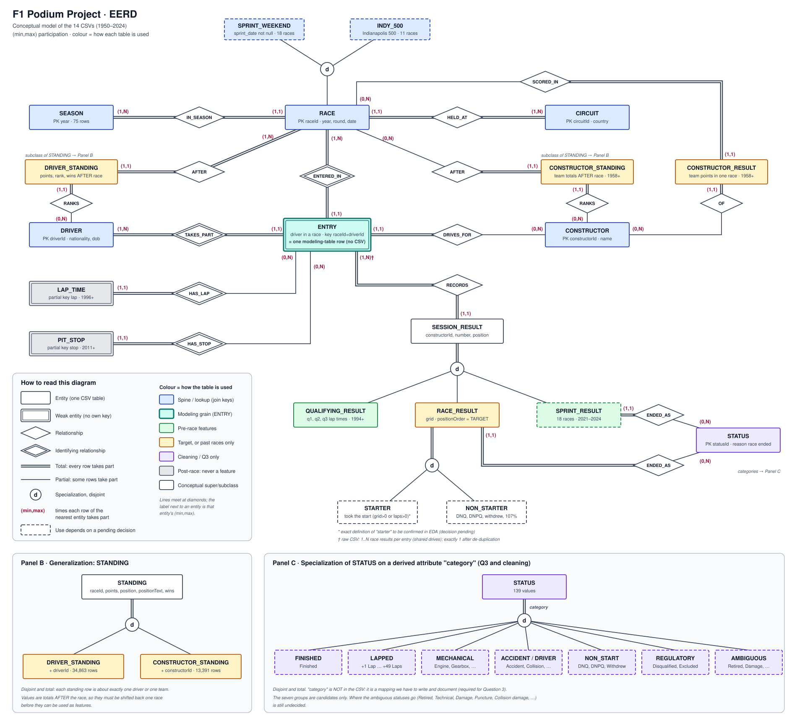
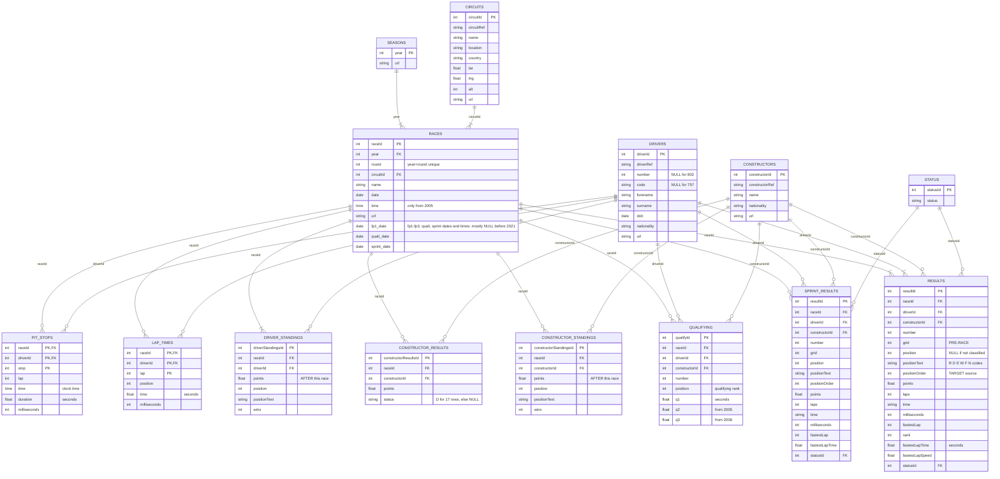

# F1 Podium Project: EERD and How the Tables Will Be Used

This document explains the Enhanced Entity-Relationship Diagram (EERD) of the 14 CSV files and how each table will be used in the project. Every cardinality and count below was checked against the CSVs in `csvs/`. **No project decisions are taken here.** Where a table's use depends on a decision that is still open, it is marked **(pending)**.

## Contents
1. [The diagram](#1-the-diagram)
2. [How to read it](#2-how-to-read-it)
3. [Entities](#3-entities)
4. [Relationships and cardinalities](#4-relationships-and-cardinalities)
5. [The "enhanced" parts: specialization and generalization](#5-the-enhanced-parts-specialization-and-generalization)
6. [From the EERD to the CSV files (logical schema)](#6-from-the-eerd-to-the-csv-files-logical-schema)
7. [How the tables will be used](#7-how-the-tables-will-be-used)
8. [Data-quality findings at the relationship level](#8-data-quality-findings-at-the-relationship-level)

---

## 1. The diagram



> If the image does not show, open `F1_EERD.svg` directly in VS Code or a browser.

---

## 2. How to read it

| Symbol | Meaning |
|---|---|
| Rectangle | **Entity**: a kind of thing we store (usually one CSV) |
| Double rectangle | **Weak entity**: cannot be identified on its own; it borrows its key from an owner |
| Diamond | **Relationship** between entities |
| Double diamond | **Identifying relationship**: the link that gives a weak entity its identity |
| Double line | **Total participation**: *every* row of that entity takes part |
| Single line | **Partial participation**: only *some* rows take part |
| Circle with **d** | **Specialization / generalization**, **disjoint** (each row belongs to at most one subclass) |
| Double line into a circle | The specialization is **total** (every superclass row is in some subclass) |
| Dashed border | How this entity is used depends on a **pending decision** |

**(min,max) notation:** the label next to an entity says how many times *each row of that entity* takes part in the relationship.
Example: `SEASON (1,N) — IN_SEASON — (1,1) RACE` means each season has at least 1 and possibly many races, and each race belongs to exactly 1 season.

**Colours = how the table will be used:**

| Colour | Role | Tables |
|---|---|---|
| Blue | **Spine / lookup**: provides keys and descriptive attributes | SEASON, RACE, CIRCUIT, DRIVER, CONSTRUCTOR |
| Teal | **Modeling grain**: one row = one prediction | ENTRY |
| Green | **Pre-race features** for the race being predicted | QUALIFYING_RESULT, SPRINT_RESULT (pending) |
| Amber | **Target**, or usable **only from past races** | RACE_RESULT, DRIVER_STANDING, CONSTRUCTOR_STANDING, CONSTRUCTOR_RESULT |
| Purple | **Cleaning and Question 3** only | STATUS |
| Gray | **Post-race**: never a feature | LAP_TIME, PIT_STOP |
| White | Conceptual superclass or subclass (not a separate CSV) | SESSION_RESULT, STANDING, STARTER/NON_STARTER |

---

## 3. Entities

### Strong entities (have their own key)
| Entity | CSV | Key | Rows | Main attributes |
|---|---|---|---|---|
| SEASON | `seasons.csv` | `year` | 75 | url |
| CIRCUIT | `circuits.csv` | `circuitId` | 77 | name, location, **country**, lat, lng, alt |
| RACE | `races.csv` | `raceId` (alternate key: `year`+`round`) | 1,125 | year, round, circuitId, name, **date**, time, session dates |
| DRIVER | `drivers.csv` | `driverId` | 861 | forename, surname, code, number, **dob**, **nationality** |
| CONSTRUCTOR | `constructors.csv` | `constructorId` | 212 | name, nationality |
| STATUS | `status.csv` | `statusId` | 139 | status (text reason the race ended) |

### The central entity: ENTRY (conceptual, weak)
**ENTRY = one driver taking part in one race.** It has **no CSV of its own** and no key of its own. It is identified by its two owners, **RACE + DRIVER**, so its key is (`raceId`, `driverId`).

Why model it:
- The brief requires **exactly one row per (`raceId`, `driverId`)**. That row is an ENTRY.
- Every qualifying, sprint, lap-time and pit-stop row **belongs to an existing entry**. **(verified:** 0 orphan (`raceId`, `driverId`) pairs in all four tables.)
- In the raw `results.csv` an entry can have **more than one** result row (shared drives: 85 entries, 176 rows). Separating ENTRY from RACE_RESULT makes this visible.
- **After cleaning, the ENTRY set becomes the modeling table.**

### Weak entities (post-race detail)
| Entity | CSV | Owner | Partial key | Full key | Rows | Years |
|---|---|---|---|---|---|---|
| LAP_TIME | `lap_times.csv` | ENTRY | `lap` | (`raceId`, `driverId`, `lap`) | 589,081 | 1996+ |
| PIT_STOP | `pit_stops.csv` | ENTRY | `stop` | (`raceId`, `driverId`, `stop`) | 11,371 | 2011+ |

### Result and standing entities
| Entity | CSV | Surrogate key | Natural key | Rows |
|---|---|---|---|---|
| QUALIFYING_RESULT | `qualifying.csv` | `qualifyId` | (`raceId`, `driverId`), unique | 10,494 |
| RACE_RESULT | `results.csv` | `resultId` | (`raceId`, `driverId`), **not unique (91 surplus rows)** | 26,759 |
| SPRINT_RESULT | `sprint_results.csv` | `resultId` | (`raceId`, `driverId`), unique | 360 |
| DRIVER_STANDING | `driver_standings.csv` | `driverStandingsId` | (`raceId`, `driverId`), unique | 34,863 |
| CONSTRUCTOR_STANDING | `constructor_standings.csv` | `constructorStandingsId` | (`raceId`, `constructorId`), unique | 13,391 |
| CONSTRUCTOR_RESULT | `constructor_results.csv` | `constructorResultsId` | (`raceId`, `constructorId`), unique | 12,625 |

---

## 4. Relationships and cardinalities

All participation numbers are **(verified)** against the CSVs.

| Relationship | Between | (min,max) | Participation evidence |
|---|---|---|---|
| **IN_SEASON** | SEASON — RACE | SEASON (1,N) · RACE (1,1) | All 75 seasons have races (7 to 24 each) |
| **HELD_AT** | RACE — CIRCUIT | RACE (1,1) · CIRCUIT (1,N) | All 77 circuits hosted at least one race (Monza: 74) |
| **ENTERED_IN** (identifying) | RACE — ENTRY | RACE (1,N) · ENTRY (1,1) | All 1,125 races have entries (max 55 rows in one race) |
| **TAKES_PART** (identifying) | DRIVER — ENTRY | DRIVER (1,N) · ENTRY (1,1) | All 861 drivers have at least one result |
| **DRIVES_FOR** | ENTRY — CONSTRUCTOR | ENTRY (1,1) · CONSTRUCTOR (0,N) | 211 of 212 teams have results (Eagle, id 88, has none). Since 2014, max 2 cars per team per race |
| **RECORDS** | ENTRY — SESSION_RESULT | ENTRY (1,N)† · SESSION_RESULT (1,1) | Every entry has at least 1 race result; 0..1 qualifying; 0..1 sprint |
| **HAS_LAP** (identifying) | ENTRY — LAP_TIME | ENTRY (0,N) · LAP_TIME (1,1) | Only 544 races (1996+) have lap data |
| **HAS_STOP** (identifying) | ENTRY — PIT_STOP | ENTRY (0,N) · PIT_STOP (1,1) | Only 285 races (2011+) have pit data |
| **ENDED_AS** | RACE_RESULT — STATUS | RACE_RESULT (1,1) · STATUS (0,N) | 137 of 139 statuses used ("+49 Laps", "+38 Laps" never used) |
| **ENDED_AS** | SPRINT_RESULT — STATUS | SPRINT_RESULT (1,1) · STATUS (0,N) | Only 8 statuses ever appear in sprints |
| **AFTER** | DRIVER_STANDING — RACE | DRIVER_STANDING (1,1) · RACE (1,N) | All 1,125 races have driver standings |
| **RANKS** | DRIVER_STANDING — DRIVER | DRIVER_STANDING (1,1) · DRIVER (0,N) | 854 of 861 drivers appear in standings |
| **AFTER** | CONSTRUCTOR_STANDING — RACE | CONSTRUCTOR_STANDING (1,1) · RACE (0,N) | 1,061 of 1,125 races (none before 1958) |
| **RANKS** | CONSTRUCTOR_STANDING — CONSTRUCTOR | CONSTRUCTOR_STANDING (1,1) · CONSTRUCTOR (0,N) | 160 of 212 teams |
| **SCORED_IN** | CONSTRUCTOR_RESULT — RACE | CONSTRUCTOR_RESULT (1,1) · RACE (0,N) | 1,060 of 1,125 races (1958+) |
| **OF** | CONSTRUCTOR_RESULT — CONSTRUCTOR | CONSTRUCTOR_RESULT (1,1) · CONSTRUCTOR (0,N) | 175 of 212 teams |

† In the raw CSV an entry can have 1..N race results (shared drives). After de-duplication it is exactly 1.

**Why standings link to RACE and DRIVER, not to ENTRY:** a standings row exists for every driver *in the championship at that point*, including drivers who **did not race** that weekend. **(verified:** 8,664 standings rows have no matching result row.) So a standing is "driver X's total after race R", not "driver X's result in race R".

---

## 5. The "enhanced" parts: specialization and generalization

These are what make it an **E**ERD. They group rows into super- and sub-types.

| # | Superclass → subclasses | Type | Constraints | Defined by | Why it matters |
|---|---|---|---|---|---|
| 1 | **RACE** → SPRINT_WEEKEND, INDY_500 | Specialization | **Disjoint, partial** (most races are neither) | Predicates: `sprint_date` not null (18 races); name = "Indianapolis 500" (11 races, 1950-1960) | Sprint data exists only for sprint weekends; the Indy 500 is a candidate for exclusion **(pending)** |
| 2 | **SESSION_RESULT** → QUALIFYING_RESULT, RACE_RESULT, SPRINT_RESULT | Generalization | **Disjoint, total** | Which session the row comes from | The three tables share `raceId, driverId, constructorId, number, position`, but only the race result holds the target |
| 3 | **RACE_RESULT** → STARTER, NON_STARTER | Specialization | **Disjoint, total** | Proposed predicate: started if `grid > 0` or `laps > 0` (**to be confirmed in EDA**) | 1,613 non-start rows (DNQ, DNPQ, Withdrew, 107%) can never reach the podium; keep or drop **(pending)** |
| 4 | **STANDING** → DRIVER_STANDING, CONSTRUCTOR_STANDING | Generalization | **Disjoint, total** | Driver or team | Same structure (`raceId, points, position, positionText, wins`) and the same leakage rule: shift back one race |
| 5 | **STATUS** → FINISHED, LAPPED, MECHANICAL, ACCIDENT/DRIVER, NON_START, REGULATORY, AMBIGUOUS | Attribute-defined specialization | **Disjoint, total** | A derived attribute `category` that **we must create** | Required for Question 3. The seven groups are candidates only; where ambiguous statuses go is **pending** |

Note on #2: the qualifying `position` and race `position` share a name but mean different things (qualifying rank vs. finishing place). That's exactly why Question 1 insists on distinguishing them.

---

## 6. From the EERD to the CSV files (logical schema)

How the conceptual model maps onto the files:
- Every strong entity is one CSV, with its key as the primary key.
- **ENTRY has no CSV.** It will be created by us from `results.csv` once the grain is fixed.
- The SESSION_RESULT subclasses are stored as **three separate CSVs** (one table per subclass, no superclass table).
- The STANDING subclasses are likewise **two separate CSVs**.
- RACE's subclasses, STARTER/NON_STARTER, and STATUS categories have **no table**; they are flags or mappings we derive.

The full logical schema with every column is below. (Renders as a diagram on GitHub and in VS Code with a Mermaid extension; otherwise read it as text. Types are the semantic types after cleaning.)



---

## 7. How the tables will be used

### 7.1 The key idea: one table, two sides of the cutoff

A table is not simply "allowed" or "forbidden". It depends on **which race the row is about**:

| Row is about... | Example | Usable? |
|---|---|---|
| An **earlier** race | Driver's finishing positions in his last 5 races | **Yes**: it's history, known before this race |
| **This** race, a **pre-race** column | `results.grid`, `qualifying.position` for this race | **Yes** |
| **This** race, a **post-race** column | `results.positionOrder`, `points`, `laps`, `statusId` for this race | **No**: leakage (except `positionOrder`, which is the **target**) |
| **This** race, a standing | `driver_standings` row for this race | **No**: it already includes this race's points. Use the **previous** race's row |

So `results.csv` plays **three roles at once**: it defines the rows (ENTRY), it gives the target (this race's `positionOrder`), and it supplies history features (earlier races' results).

### 7.2 Timeline: when each piece of information becomes known

```
BEFORE THE WEEKEND             SATURDAY (after qualifying)        [CUTOFF]   SUNDAY AND AFTER
-------------------            ---------------------------                   ----------------
drivers (dob, nationality)     qualifying (this race)                        results: position, positionText,
constructors                   results.grid (this race)                        positionOrder (TARGET), points,
circuits, races, seasons       sprint_results (this race)*                     laps, time, fastest lap, status
all PAST-race rows of:                                                       standings for this race
  results, qualifying,                                                       constructor_results for this race
  standings, constructor_results,                                            pit_stops, lap_times
  status, sprint_results
```
\* sprint weekends only, 2021-2024 (use pending).

### 7.3 Role of every table

| Table | Role | Audit (keys, sentinels) | Target | Pre-race features (this race) | Past-races-only features | Q1 | Q2 | Q3 | Notes |
|---|---|---|---|---|---|---|---|---|---|
| `races` | Spine | ✓ | | year, round, circuit | | ✓ | ✓ | ✓ | `year` drives the train/val/test split and era splits |
| `results` | Grain + target + history | ✓ (grain!) | ✓ `positionOrder` | `grid` | positions, points, status of earlier races | ✓ | ✓ | ✓ | Must be de-duplicated to one row per entry **(rule pending)** |
| `qualifying` | Pre-race | ✓ | | position, q1/q2/q3 | | ✓ | | | Coverage only 1994+ (complete 2003+) |
| `drivers` | Lookup | ✓ | | nationality, age from `dob` | | | ✓ | | Nationality to country map needed **(pending)** |
| `constructors` | Lookup | ✓ | | team identity | | | | ✓ | Renamed teams have different ids; lineage **(pending)** |
| `circuits` | Lookup | ✓ | | circuit identity, country | | ✓ | ✓ | | `USA` / `United States` duplicate label |
| `status` | Cleaning + Q3 | ✓ | | | e.g. past reliability | | | ✓ | Needs the `category` mapping **(pending)** |
| `driver_standings` | Lagged | ✓ | | | points, rank, wins **before** the race | | | | Shift back one race |
| `constructor_standings` | Lagged | ✓ | | | team points/rank **before** the race | | | | None before 1958 |
| `constructor_results` | Lagged / cross-check | ✓ | | | team points in earlier races | | | | Can cross-check `results.points` |
| `sprint_results` | Pre-race (optional) | ✓ | | sprint finish, points | | | | | 18 races only **(pending)** |
| `seasons` | Lookup | ✓ | | | | | | | FK target for `races.year` only |
| `pit_stops` | Post-race | ✓ | | | | | | | **Never a feature** (PDF glossary); EDA only |
| `lap_times` | Post-race | ✓ | | | | | | | **Never a feature**; EDA only |

### 7.4 Building the modeling table: the join plan

Each step names the join keys and the leakage rule. Steps marked **(pending)** contain a choice that has not been made.

| Step | What | Join | Leakage / caution |
|---|---|---|---|
| 0 | Load all CSVs as copies; `\N` and empty strings to missing; parse dates, convert lap times to seconds | – | Raw files never modified |
| 1 | Create **ENTRY** from `results`: one row per (`raceId`, `driverId`) | – | Duplicate rule **(pending)** |
| 2 | Add race context | `races` on `raceId`, then `circuits` on `circuitId` | Static, safe |
| 3 | Add driver context | `drivers` on `driverId` | Age = race `date` − `dob`; home flag needs a mapping **(pending)** |
| 4 | Add starting position | `grid` from the same `results` row | `grid = 0` means pit lane **or** non-starter **(pending)** |
| 5 | Add qualifying | `qualifying` on (`raceId`, `driverId`), **left join** | Missing for most pre-2003 rows |
| 6 | Add driver standings **before** the race | Find the previous `raceId` in the same season (by `round`), then `driver_standings` on (previous `raceId`, `driverId`) | Round 1 has no previous race in the season **(pending)** |
| 7 | Add constructor standings **before** the race | Same idea on (previous `raceId`, `constructorId`) | Missing before 1958 |
| 8 | Add form (history) features | From `results` (and `status`) of **earlier** races only: sort by date, group by driver or team, shift by one before any rolling average | Never include the current race |
| 9 | Optionally add sprint | `sprint_results` on (`raceId`, `driverId`), left join | **(pending)** |
| 10 | Target | `podium = positionOrder <= 3` from this entry's result | The only post-race field allowed, as the label |
| 11 | Row filters | Non-starters, Indy 500, season window | **(pending)** |
| 12 | Split by season | train ≤ 2019 · validation 2020-2021 · test ≥ 2022 (from the PDF) | Thresholds and tuning on train/validation only |

The previous-race lookup in steps 6-7 is safe to build because (`year`, `round`) is unique in `races.csv` **(verified)**. That lets us order races inside a season reliably.

### 7.5 Join paths for the three data-engineering questions

**Question 1: front-row conversion by circuit, before and after 2014**
```
results ──raceId──► races ──circuitId──► circuits
   └──(raceId, driverId)──► qualifying
```
- Front row by **grid**: `results.grid` in {1, 2}. Front row by **qualifying**: `qualifying.position` in {1, 2}. Compare both.
- Podium: `positionOrder <= 3`. Era: `races.year < 2014` vs `>= 2014`.
- Grain: one row per entry that started on the front row. Missingness: qualifying only 1994+, so the qualifying version covers fewer years than the grid version.

**Question 2: home advantage, controlling for starting position**
```
results ──driverId──► drivers (nationality)
   └──raceId──► races ──circuitId──► circuits (country)
              + our nationality-to-country mapping
```
- Home = mapped driver country equals circuit country.
- Control: compare home vs. away **within the same grid bucket** (e.g. grid 1-3, 4-6, ...).
- Cautions: Indy 500 inflates American "home" races; dual nationalities and `USA` / `United States` labels need the mapping.

**Question 3: mechanical-retirement rate by constructor, 2014-2021 vs 2022-2024**
```
results ──statusId──► status (+ our category mapping)
   ├──raceId──► races (year for the era)
   └──constructorId──► constructors (name; lineage decision)
```
- Denominator: race starts (STARTER rows). Numerator: starts whose status category is MECHANICAL.
- Cautions: ambiguous statuses (`Retired`, `Technical`, `Damage`...); rebrands (Toro Rosso → AlphaTauri → RB, Force India → Racing Point → Aston Martin, Sauber ↔ Alfa Romeo, Renault → Alpine).

### 7.6 Candidate features by source table (not decided)

| Source | Candidate features | Available from |
|---|---|---|
| `results` (this race) | grid, pit-lane flag | 1950 |
| `qualifying` (this race) | qualifying position, best lap, gap to pole, qualifying-vs-grid difference | 1994 (complete 2003) |
| `driver_standings` (previous race) | points, championship rank, wins so far | 1950 |
| `constructor_standings` (previous race) | team points, team rank, team wins so far | 1958 |
| `results` (earlier races) | driver's recent average finish, recent podium rate, team's recent podium rate, finishes at this circuit | 1950 |
| `results` + `status` (earlier races) | recent mechanical DNF rate (reliability) | 1950 |
| `drivers` + `races` | age at race date, experience (number of previous starts) | 1950 |
| `drivers` + `circuits` | home-race flag | 1950 |
| `races` | year / era, round number in season | 1950 |
| `sprint_results` (this weekend) | sprint finish, sprint points | 2021 |

These are options to justify later with EDA, as the brief requires. None has been selected.

---

## 8. Data-quality findings at the relationship level

**(verified)** while building the diagram:

| Finding | Detail | Affects |
|---|---|---|
| Duplicate entries in `results` | 85 (`raceId`, `driverId`) groups, 176 rows (91 surplus), 1950-1964 + one 1978 case | ENTRY grain |
| Team name drift inside one race weekend | In 10 rows (five 2015 races), `qualifying` says **Marussia** (id 206) while `results` says **Manor Marussia** (id 209) for the same driver | Team features; joining qualifying by team |
| Standings for drivers who didn't race | 8,664 standings rows have no result row that race | How standings are joined (by driver, not by entry) |
| Drivers never in standings | 7 of 861 drivers | Missing lagged features |
| Constructor results vs. results | 7 team-race pairs in `constructor_results` have no `results` rows; 410 team-race pairs (1958+) in `results` have no `constructor_results` row | Using `constructor_results` as a feature or a check |
| Unused lookups | Constructor **Eagle** (id 88) appears nowhere; statuses "+49 Laps" and "+38 Laps" are never used | Harmless; worth one line in the audit |
| Referential integrity | All 23 foreign keys: **0 orphans**; all 14 primary keys unique and non-null | Audit passes |

See also `F1_project_explained.md` (Section 7) for the data problems found earlier, and `F1_data_overview.md` for the full numbers.
